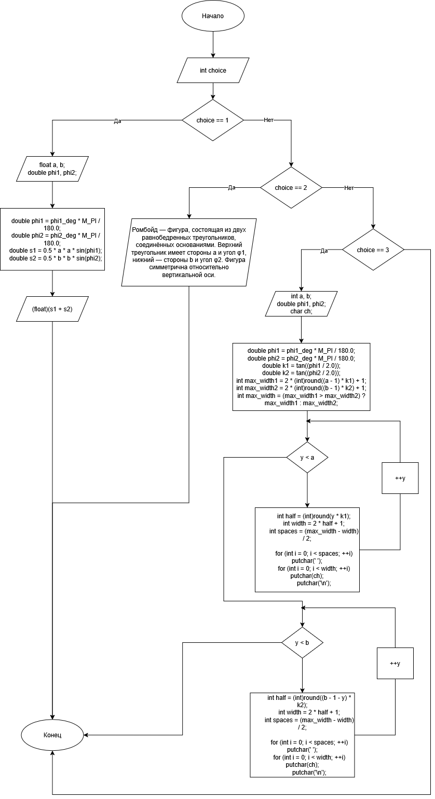
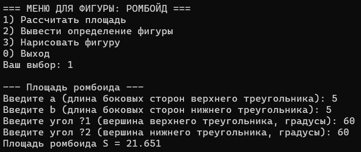
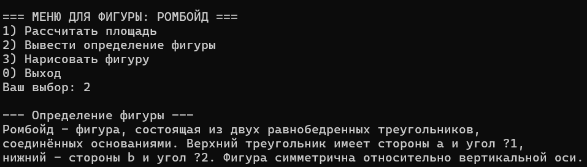
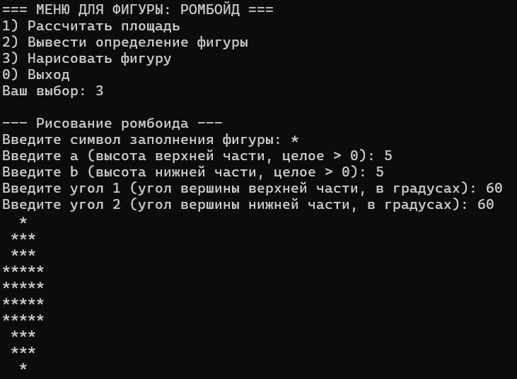

# Домашнее задание к работе 9

## Условие задачи
Составить программу для заданной пользователем фигуры — **ромбоида** (фигура из двух равнобедренных треугольников, соединённых основаниями), которая предлагает меню выбора одной из операций:
1. рассчитать площадь фигуры;
2. вывести определение фигуры;
3. нарисовать фигуру символом, задаваемым с клавиатуры.

## 1. Алгоритм и блок-схема

### Алгоритм
1. **Начало.**
2. Организовать цикл `do … while`, который будет выполняться до выбора пункта меню `0` (выход).
3. В начале цикла вывести меню.
4. Считать выбор пользователя в переменную `choice`.
5. В зависимости от `choice`:
   - **Если `choice == 1`**  
     5.1. Запросить у пользователя параметры фигуры:  
          `a` – длина боковых сторон верхнего треугольника;  
          `b` – длина боковых сторон нижнего треугольника;  
          `phi1` – угол вершины верхнего треугольника (в градусах);  
          `phi2` – угол вершины нижнего треугольника (в градусах).  
     5.2. Вызвать функцию `area_rhomboid(a, b, phi1, phi2)` и вывести полученное значение площади.
   - **Если `choice == 2`**  
     5.3. Вызвать функцию `print_definition_rhomboid()`, которая выводит на экран текстовое определение ромбоида.
   - **Если `choice == 3`**  
     5.4. Запросить у пользователя символ заполнения `ch`, высоту верхней части `a`, высоту нижней части `b` и углы `phi1`, `phi2` (в градусах).  
     5.5. Вызвать функцию `draw_rhomboid(a, b, phi1, phi2, ch)`, которая рисует фигуру на экране.
   - **Иначе (любое другое значение)**  
     5.6. Вывести сообщение об ошибке ввода пункта меню.
6. Повторять шаги 4–6, пока пользователь не выберет `0`.
7. Вывести сообщение о завершении работы программы.
9. **Конец.**

### Блок-схема


https://github.com/DragonSov/lab10_homework/blob/master/schema.png

## 2. Реализация программы

```c
#include <stdio.h>
#include <locale.h>
#define _USE_MATH_DEFINES
#include <math.h>

// площадь ромбоида = сумма площадей двух равнобедренных треугольников
// S1 = a^2/2 * sin(phi1), S2 = b^2/2 * sin(phi2), угол в ГРАДУСАХ
float area_rhomboid(float a, float b, double phi1_deg, double phi2_deg) {
    double phi1 = phi1_deg * M_PI / 180.0;
    double phi2 = phi2_deg * M_PI / 180.0;

    double s1 = 0.5 * a * a * sin(phi1);
    double s2 = 0.5 * b * b * sin(phi2);

    return (float)(s1 + s2);
}

// определение фигуры
void print_definition_rhomboid(void) {
    printf("Ромбойд — фигура, состоящая из двух равнобедренных треугольников,\n");
    printf("соединённых основаниями. Верхний треугольник имеет стороны a и угол φ1,\n");
    printf("нижний — стороны b и угол φ2. Фигура симметрична относительно вертикальной оси.\n\n");
}

// рисование ромбоида так же, как в предыдущем задании
void draw_rhomboid(int a, int b, double phi1_deg, double phi2_deg, char ch) {
    double phi1 = phi1_deg * M_PI / 180.0;
    double phi2 = phi2_deg * M_PI / 180.0;

    double k1 = tan((phi1 / 2.0));
    double k2 = tan((phi2 / 2.0));

    int max_width1 = 2 * (int)round((a - 1) * k1) + 1;
    int max_width2 = 2 * (int)round((b - 1) * k2) + 1;
    int max_width = (max_width1 > max_width2) ? max_width1 : max_width2;

    // верхняя часть
    for (int y = 0; y < a; ++y) {
        int half = (int)round(y * k1);
        int width = 2 * half + 1;
        int spaces = (max_width - width) / 2;

        for (int i = 0; i < spaces; ++i) putchar(' ');
        for (int i = 0; i < width; ++i) putchar(ch);
        putchar('\n');
    }

    // нижняя часть
    for (int y = 0; y < b; ++y) {
        int half = (int)round((b - 1 - y) * k2);
        int width = 2 * half + 1;
        int spaces = (max_width - width) / 2;

        for (int i = 0; i < spaces; ++i) putchar(' ');
        for (int i = 0; i < width; ++i) putchar(ch);
        putchar('\n');
    }
}

int main(void) {
    setlocale(LC_CTYPE, "RUS");

    int choice;
    do {
        printf("=== МЕНЮ ДЛЯ ФИГУРЫ: РОМБОЙД ===\n");
        printf("1) Рассчитать площадь\n");
        printf("2) Вывести определение фигуры\n");
        printf("3) Нарисовать фигуру\n");
        printf("0) Выход\n");
        printf("Ваш выбор: ");
        scanf("%d", &choice);

        if (choice == 1) {
            float a, b;
            double phi1, phi2;

            printf("\n--- Площадь ромбоида ---\n");
            printf("Введите a (длина боковых сторон верхнего треугольника): ");
            scanf("%f", &a);
            printf("Введите b (длина боковых сторон нижнего треугольника): ");
            scanf("%f", &b);
            printf("Введите угол φ1 (вершина верхнего треугольника, градусы): ");
            scanf("%lf", &phi1);
            printf("Введите угол φ2 (вершина нижнего треугольника, градусы): ");
            scanf("%lf", &phi2);

            float s = area_rhomboid(a, b, phi1, phi2);
            printf("Площадь ромбоида S = %.3f\n\n", s);
        }
        else if (choice == 2) {
            printf("\n--- Определение фигуры ---\n");
            print_definition_rhomboid();
        }
        else if (choice == 3) {
            int a, b;
            double phi1, phi2;
            char ch;

            printf("\n--- Рисование ромбоида ---\n");
            printf("Введите символ заполнения фигуры: ");
            scanf(" %c", &ch);  // пробел перед %c, чтобы съесть '\n'

            printf("Введите a (высота верхней части, целое > 0): ");
            scanf("%d", &a);

            printf("Введите b (высота нижней части, целое > 0): ");
            scanf("%d", &b);

            printf("Введите угол 1 (угол вершины верхней части, в градусах): ");
            scanf("%lf", &phi1);

            printf("Введите угол 2 (угол вершины нижней части, в градусах): ");
            scanf("%lf", &phi2);

            draw_rhomboid(a, b, phi1, phi2, ch);
            printf("\n");
        }
        else if (choice != 0) {
            printf("Неизвестный пункт меню, попробуйте ещё раз.\n\n");
        }

    } while (choice != 0);

    printf("Выход из программы.\n");
    return 0;
}
```

## 3. Результаты работы программы




## 4. Информация о разработчике
Попов Станислав, бИПТ-252